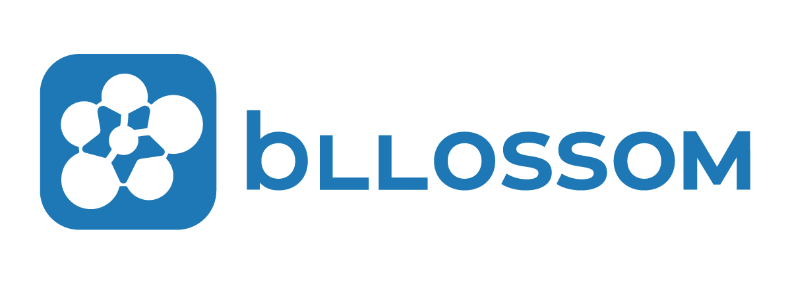

# bllossom

| [Demo](http://121.134.238.173:7862/) | [Homepage](http://teddysum.ai/) |

**Korean LLM made by [Teddysum](http://teddysum.ai/)**

bllossom 의 특징들:

* **Lightweight**: 경량화된 모델과 학습방법 적용
* **Localization**: 한국어/한국문화에 특화된 한국어 LLM
* **Summarization**: 대화 이해와 요약에 특화 (미적용)
* **Automated Writing Evaluation**: AI 글쓰기 자동 평가 (미적용)

## NEWS
* [2023/07] We released the backbone model LLaMa-v2-korean Model.
* [2023/07] We released bllossom v0.7. Check out the [demo](http://121.134.238.173:7862/)

## Models
### Backbone Model
* Korean LLaMa Model (not published yet, co-work with `MLP Lab`(임경태 교수 외))
* [polyglot-ko-13b](https://huggingface.co/EleutherAI/polyglot-ko-1.3b)

### Model

#### bllossom v0.7
* **Backbone Model**: LLaMa-2, Polyglot-ko
* **Low-bit Quantization**: 기존 32bit backbone 모델에 양자화 기술(quantization) 접목된 [qlora](https://github.com/artidoro/qlora) 기반 미세조정(fine-tuning)
  - 4bit 및 8bit 학습 수행
  - (Quantized Model은 추후 공개)
* **Small amount of data**: 최소한의 instruction tuning dataset 사용. LIMA의 한국어화된 localized LIMA 데이터셋 사용(추후 공개)
* **Framework**: transformers, bitsandbytes, peft, accelerate

##### **v0.7 MODELS:**
* **Llama-2-13b-chat-hf-4bit quantinization** [link](http://TBU)
  - used GPU memory: 9401Mib
* **Llama-2-13b-chat-hf-8bit quantinization** [link](http://TBU)
  - used GPU memory: 15647MiB
* **polyglot-ko-12.8b-4bit quantinization** [link](http://TBU)
  - used GPU memory: 9107Mib
* **polyglot-ko-12.8b-8bit quantinization** [link](http://TBU)
  - used GPU memory: 14979MiB
  

## Contents
* [Version Description](https://github.com/teddysum/bllossom#version-description)
* [Install](https://github.com/teddysum/bllossom/#install)

### Version Description
| Version| Release      | Contents           | License     | 비고     |
|:------:|:------------:|--------------------|:------------:|:--------:|
| v0.7   | 2023-07-24   | 기본 버전           |`CC BY-NC-SA`|llama2, polyglot 기반|
| v0.8   | (2023-08-15) | Ko-LIMA 1.1         |   -         |          |
| v0.9   | (2023-08-29) | 한국어 능력 향상     |   -         |           |
| v1.0   | (2023-08-29) | 테디썸 요약기술 적용 |   -         |           |
| v1.1   | -            | 성능 향상            |   -         |          |

### Install
TBU

### Evaluation
TBU

## Publisher
[Teddysum](http://teddysum.ai/)

## Authors
* `Teddysum, Inc.` (함영균, 정용빈, 서현빈, 윤찬혁, 박재완, 이이슬)
* `Yonsei Univ.` [link](https://sites.google.com/view/hansaemkim/hansaem-kim) (김한샘 교수 연구팀-김한샘, 강예지, 박서윤)
* `MLP Lab`@seoultech [link](https://sites.google.com/view/aailab) (임경태 교수 연구팀-임경태, 최창수, 김상민, 임현석, 원인호)

## Contact
함영균(Younggyun Hahm), CEO of Teddysum. `hahmyg@teddysum.ai`
